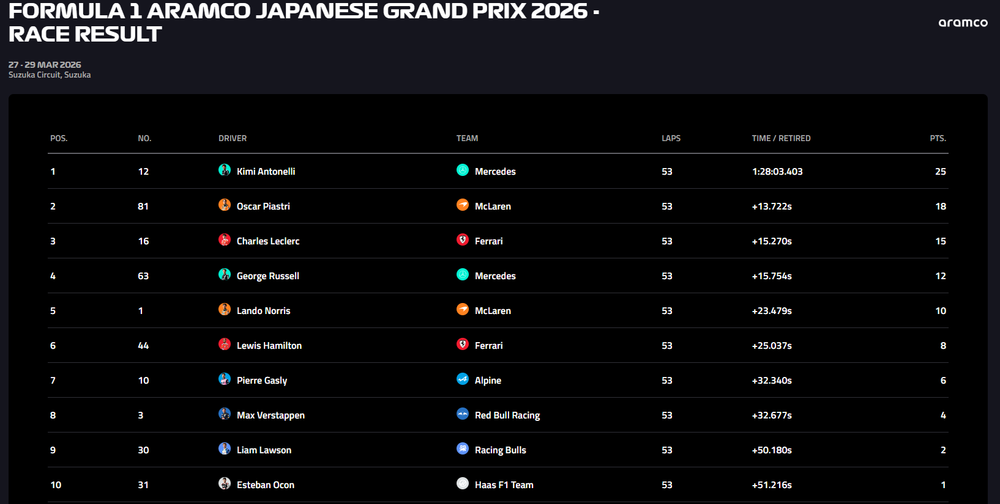

# F1 Race Predictor 🏎️

Sistema de predicción de resultados de carreras de Fórmula 1 basado en Machine Learning.

**Proyecto para Principios y Tecnologías de Inteligencia Artificial — PTIA**  
**Escuela Colombiana de Ingeniería Julio Garavito**

## Desarrollado por
- David Alejandro Patacón Henao
- Samuel Antonio Gil Romero

---

## Descripción

Este proyecto implementa un pipeline completo de Machine Learning para predecir las posiciones finales de los 20 pilotos en una carrera de Fórmula 1. El modelo utiliza **XGBoost Regressor** entrenado sobre datos reales obtenidos de la API oficial de F1 a través de la librería **FastF1**.

La predicción se genera a partir de datos de clasificación (que ya ocurrieron) combinados con features históricas de piloto, equipo y circuito computadas sin data leakage.

---

## Estructura del Proyecto

```
fastai_ptia/
├── config/
│   ├── settings.py          # Hiperparámetros, constraints, FEATURE_DEFAULTS
│   └── circuits.py          # Metadata de 24 circuitos (tipo, gap/slot, lat/lon)
├── data/
│   ├── data_loader.py       # Descarga desde FastF1 (carrera + clasificación + clima)
│   ├── weather.py           # Fetch OpenWeatherMap para predict.py
│   └── cache/               # Cache de FastF1 (no borrar)
├── features/
│   └── engineering.py       # 18 features vectorizadas + export_historical_stats()
├── models/
│   ├── trainer.py           # XGBoost + TimeSeriesSplit CV + monotone constraints
│   └── saved/               # Modelos .pkl serializados
├── evaluation/
│   └── metrics.py           # MAE, RMSE, Top-3 Accuracy
├── outputs/
│   └── reports/
│       ├── training_report.json     # Métricas de CV + test + feature importances
│       └── historical_stats.json    # Stats por piloto/equipo para predict.py
├── main.py                  # Pipeline de entrenamiento (5 pasos)
├── predict.py               # Inferencia (lee clasificación + historical_stats.json)
└── requirements.txt
```

---

## Tecnologías

| Tecnología | Versión | Uso |
|-----------|---------|-----|
| Python | 3.9+ | Lenguaje de programacion principal |
| XGBoost | ≥2.0 | Modelo de predicción |
| FastF1 | ≥3.3 | API de datos de F1 |
| Pandas / NumPy | ≥2.0 / ≥1.24 | Manipulación de datos |
| Scikit-learn | ≥1.3 | TimeSeriesSplit, utilidades |
| Requests | ≥2.31 | Weather forecast fetch |
| python-dotenv | ≥1.0 | Variables de entorno |


## Instalación

```bash
python -m venv venv
source venv/bin/activate        # Linux/Mac
# venv\Scripts\activate         # Windows

pip install -r requirements.txt
```

### Variables de entorno opcionales

```bash
cp .env.example .env
# Editar .env:
OPENWEATHERMAP_API_KEY=tu_api_key   # Opcional: weather real en predict.py
```

---

## Uso

### Entrenar el modelo

```bash
# Temporadas completas (primera vez: ~45-90 min por descarga de datos)
python main.py --seasons 2023 2024 2025
```

Los datos se cachean en `data/cache/`. Reentrenamientos posteriores toman segundos.

### Predecir una carrera (CLI)

La clasificación del GP debe haber ocurrido antes de correr `predict.py` (se descarga de FastF1).

```bash
python predict.py --race "Monaco" --year 2026
python predict.py --race 6 --year 2026          # por número de ronda
python predict.py --race "Monaco" --year 2026 --model models/saved/model.pkl
```

### Levantar la API REST (para el frontend)

```bash
uvicorn api:app --reload --host 0.0.0.0 --port 8000
```

Docs interactivas disponibles en `http://localhost:8000/docs` (Swagger UI).

---

## API REST

El archivo `api.py` expone el pipeline como endpoints HTTP usando **FastAPI**.

### Endpoints

#### `GET /api/status`
Estado del modelo y métricas del último entrenamiento.

```json
{
  "model_available": true,
  "model_file": "xgboost_model_20260517_175003.pkl",
  "stats_available": true,
  "training_metrics": {
    "seasons": [2023, 2024, 2025],
    "train_samples": 1318,
    "mae": 3.5801,
    "rmse": 4.8444,
    "top3_accuracy": 0.6667,
    "trained_at": "2026-05-17T17:50:03"
  }
}
```

#### `GET /api/circuits`
Lista de 24 circuitos disponibles.

```json
{
  "circuits": [
    {
      "display_name": "Azerbaijan — Baku City Circuit",
      "value": "Azerbaijan",
      "circuit_key": "baku",
      "city": "Baku",
      "circuit_type": 1
    }
  ]
}
```

#### `GET /api/years`
Años soportados para predicción.

```json
{ "years": [2023, 2024, 2025, 2026] }
```

#### `POST /api/predict`
Ejecuta la predicción para una carrera y año dados.

**Request:**
```json
{ "race": "Monaco", "year": 2026 }
```

**Response:**
```json
{
  "success": true,
  "race_name": "Monaco Grand Prix",
  "year": 2026,
  "predictions": [
    {
      "position": 1,
      "driver_code": "LEC",
      "team": "Ferrari",
      "grid_position": 1,
      "score": 2.41,
      "position_change": 0
    }
  ],
  "podium": ["LEC", "NOR", "PIA"],
  "gainers": [{ "driver": "NOR", "from_pos": 4, "to_pos": 2, "change": 2 }],
  "losers":  [{ "driver": "VER", "from_pos": 2, "to_pos": 5, "change": -3 }]
}
```

### CORS

Configurado para `http://localhost:5173` (dev server de Vite). Para producción, editar `api.py:allow_origins`.

---

## Arquitectura del Pipeline

```
FastF1 API
    │
    ▼
data/data_loader.py          ← Descarga carrera + clasificación + clima
    │
    ▼
features/engineering.py      ← 18 features (vectorizadas, sin leakage)
    │
    ▼
models/trainer.py            ← XGBoost + Time-Series CV
    │
    ├── evaluation/metrics.py ← MAE, RMSE, Top-3 Accuracy
    ├── models/saved/*.pkl    ← Modelo serializado
    └── outputs/reports/      ← training_report.json + historical_stats.json
```

El pipeline de entrenamiento y el de predicción comparten los **mismos features**

---

## Features del Modelo (18 total)

### Clasificación (4)
| Feature | Descripción | Fuente |
|---------|-------------|--------|
| `quali_position` | Posición en clasificación | FastF1 Q session |
| `quali_gap_to_pole` | Diferencia en segundos al poleman (calibrada por circuito) | FastF1 Q session |
| `quali_gap_to_teammate` | Diferencia vs compañero de equipo | Calculado |
| `made_q3` | Si el piloto llegó a Q3 | FastF1 Q session |

### Históricas de Piloto (4)
| Feature | Descripción | Método de cómputo |
|---------|-------------|-------------------|
| `driver_avg_position_last_5` | Promedio de posición final, últimas 5 carreras | Rolling mean (shift 1) |
| `driver_circuit_avg_position` | Promedio histórico en este circuito | Expanding mean por (piloto, circuito) |
| `driver_dnf_rate` | Tasa de abandonos (DNFs / total carreras) | Expanding mean |
| `driver_experience` | Número de carreras completadas | Cumcount |

### De Equipo (3)
| Feature | Descripción | Método de cómputo |
|---------|-------------|-------------------|
| `team_avg_position_season` | Promedio del equipo en la temporada hasta esa fecha | Expanding mean por (equipo, año) |
| `team_reliability_rate` | Porcentaje de llegadas al final | Expanding mean |
| `constructor_standing` | Posición en el campeonato de constructores | Ranking por puntos acumulados (rondas anteriores) |

### De Circuito (4)
| Feature | Descripción |
|---------|-------------|
| `circuit_type` | Tipo: 1=Calle, 2=Permanente, 3=Híbrido |
| `circuit_length_km` | Longitud en km |
| `overtaking_difficulty` | Dificultad de adelantamiento (1–5) |
| `number_of_laps` | Número de vueltas |

### Grid y Condiciones (3)
| Feature | Descripción |
|---------|-------------|
| `grid_position` | Posición de salida |
| `is_wet_session` | Lluvia esperada (fetch real via OpenWeatherMap si API key disponible) |
| `temperature` | Temperatura ambiente (°C) |

---

## Modelo: XGBoost Regressor

### Hiperparámetros

```python
XGBOOST_PARAMS = {
    'objective': 'reg:squarederror',
    'n_estimators': 150,       # Balance rendimiento / overfitting
    'max_depth': 4,            # Previene árboles excesivamente complejos
    'learning_rate': 0.05,     # Aprendizaje conservador → mejor generalización
    'subsample': 0.8,          # Aleatoriedad → reduce overfitting
    'colsample_bytree': 0.8,
    'min_child_weight': 5,     # Evita splits en muestras muy pequeñas
    'reg_alpha': 0.1,          # Regularización L1
    'reg_lambda': 1.0,         # Regularización L2
}
```

### Restricciones Monotónicas

El modelo aplica restricciones de dominio sobre 8 features para que las predicciones respeten relaciones lógicas del deporte:

| Feature | Restricción | Lógica |
|---------|-------------|--------|
| `quali_position` | +1 (creciente) | Peor clasificación → peor resultado |
| `grid_position` | +1 | Peor salida → peor resultado |
| `quali_gap_to_pole` | +1 | Mayor brecha al pole → peor resultado |
| `driver_dnf_rate` | +1 | Mayor tasa de abandono → peor resultado esperado |
| `team_avg_position_season` | +1 | Peor promedio del equipo → peor resultado |
| `constructor_standing` | +1 | Peor posición en el campeonato → peor resultado |
| `driver_experience` | -1 (decreciente) | Más experiencia → mejor resultado esperado |
| `team_reliability_rate` | -1 | Mayor fiabilidad → mejor resultado esperado |

---

## Estrategia de Validación

### Temporal Split

El dataset se ordena cronológicamente y se divide respetando el tiempo:

```
Temporada 2023          Temporada 2024          Temporada 2025
┌────────────────┐    ┌─────────────────────┐  ┌────────────────────────────┐
│   TRAINING     │    │   TRAINING          │  │  TRAINING   │  TEST (últimas│
│   22 carreras  │    │   24 carreras       │  │  20 carr.   │  4 carreras)  │
└────────────────┘    └─────────────────────┘  └────────────────────────────┘
                                                               Rondas 21–24
```

- **Train total**: 1318 muestras (pilotos × carreras)
- **Test**: 80 muestras — últimas 4 carreras de la temporada 2025 (rondas 21–24)

### Time-Series Cross-Validation (5 folds)

```
Fold 1: ████░░░░░░░░░░░░░░░░░░░   Train: 223  Val: 219
Fold 2: ████████░░░░░░░░░░░░░░░   Train: 442  Val: 219
Fold 3: ████████████░░░░░░░░░░░   Train: 661  Val: 219
Fold 4: ████████████████░░░░░░░   Train: 880  Val: 219
Fold 5: ████████████████████░░░   Train:1099  Val: 219
```

---

## Resultados

### Cross-Validation (datos 2023–2025, sobre training set)

| Fold | Train | Val | MAE | RMSE |
|------|-------|-----|-----|------|
| 1 | 223 | 219 | 3.61 | 5.06 |
| 2 | 442 | 219 | 2.83 | 3.85 |
| 3 | 661 | 219 | 2.90 | 3.94 |
| 4 | 880 | 219 | 2.87 | 3.99 |
| 5 | 1099 | 219 | 3.32 | 4.49 |
| **Media** | | | **3.11 ± 0.31** | **4.26 ± 0.46** |

> El Fold 1 tiene mayor error porque entrena con pocos datos históricos. A partir del Fold 2 el modelo se estabiliza con MAE ~2.87–2.90.

### Test Set — Últimas 4 Carreras de 2025 (rondas 21–24)

| Métrica | Resultado | Objetivo |
|---------|-----------|----------|
| **MAE** | **3.58 posiciones** | < 3.5 |
| **RMSE** | **4.84 posiciones** | < 4.5 |
| **Top-3 Accuracy** | **66.7%** | > 60% |
| Muestras evaluadas | 80 | — |

- El MAE de 3.58 significa que en promedio el modelo se equivoca en ~3.5 posiciones respecto al resultado real.
- Top-3 Accuracy de 66.7% indica que 2 de cada 3 veces el modelo acierta quién debería estar en el podio.

### Importancia de Features

| Ranking | Feature | Importancia |
|---------|---------|-------------|
| 1 | `quali_position` | **36.7%** |
| 2 | `grid_position` | **23.1%** |
| 3 | `quali_gap_to_pole` | **10.0%** |
| 4 | `team_avg_position_season` | 5.2% |
| 5 | `team_reliability_rate` | 4.6% |
| 6 | `constructor_standing` | 4.4% |
| 7 | `driver_dnf_rate` | 3.1% |
| 8 | `driver_circuit_avg_position` | 2.3% |
| 9 | `driver_avg_position_last_5` | 2.3% |
| 10 | `made_q3` | 2.2% |
| 11 | `driver_experience` | 1.7% |
| 12 | `quali_gap_to_teammate` | 1.7% |
| 13 | `temperature` | 1.5% |
| 14 | `is_wet_session` | 1.2% |
| — | `circuit_type`, `circuit_length_km`, `overtaking_difficulty`, `number_of_laps` | 0.0% |

**Hallazgos clave:**
- La posición de clasificación concentra el 60% de la importancia total (posición + gap al pole + haber llegado a Q3). Confirma que en F1 la clasificación es el predictor más fuerte del resultado.
- Los features de equipo (`team_avg`, `reliability`, `constructor_standing`) suman ~14%, reflejando el peso de la competitividad del coche.
- Los 4 features de circuito tienen importancia 0.0%, lo que sugiere que el modelo captura el efecto del circuito de forma indirecta a través de los resultados históricos de piloto y equipo.

---

## Ejemplo de Uso Completo

### Entrenamiento

```bash
python main.py --seasons 2023 2024 2025
```

```
╔═══════════════════════════════════════════════════════════════╗
║     F1 RACE PREDICTOR - TRAINING PIPELINE                    ║
╚═══════════════════════════════════════════════════════════════╝

STEP 5: Evaluation on Test Set
--------------------------------------
  MAE  : 3.58 positions
  RMSE : 4.84 positions
  Top-3: 66.7%

STEP 6: Saving Results
  Model saved to: models/saved/xgboost_model_20260517_175003.pkl
  Report saved to: outputs/reports/training_report.json
  Historical stats saved to: outputs/reports/historical_stats.json
```

### Predicción — Gran Premio de Japón 2026

```bash
python predict.py --race "Japon" --year 2026
```

```
╔═══════════════════════════════════════════════════════════════╗
║                    F1 RACE PREDICTION                         ║
╠═══════════════════════════════════════════════════════════════╣
║  Japanese Grand Prix                                          ║
║  Season 2026                                                  ║
╚═══════════════════════════════════════════════════════════════╝

=================================================================
 POS DRIVER TEAM                        GRID    SCORE
=================================================================
  P1 ANT    Mercedes                       1     2.60
  P2 PIA    McLaren                        3     3.37
  P3 LEC    Ferrari                        4     3.93
 P04 RUS    Mercedes                       2     3.94
 P05 NOR    McLaren                        5     4.62
 P06 HAM    Ferrari                        6     5.35
 P07 HAD    Red Bull Racing                8     7.01
 P08 VER    Red Bull Racing               11     9.28
 ...
=================================================================
```

Resultado real:



> **El modelo predijo correctamente las primeras 5 posiciones del Grand Prix de Japón 2026.**

